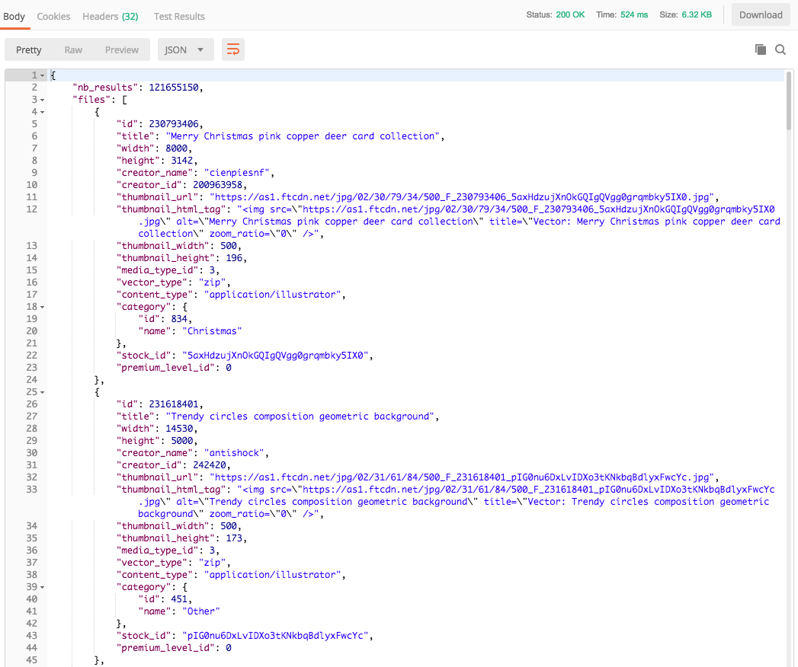

# Instructions

## Step 1
You will receive couple of emails from Adobe for Adobe Experience Cloud Access.

## Step 2
Follow link in email and setup your Adobe ID.

## Step 3
Open your web browser and go to: [https://experiencecloud.adobe.com](https://experiencecloud.adobe.com)

# The challenge

## Challenge-1: Adobe Stock API
Adobe stock give users access to stunning Adobe Stock high-quality images, graphics, and videos to use in their ads, email templates, and websites.

**Challenge: Using the Adobe Stock API, search for images with keyword `kittens`. The end result should be an API response with `Status: 200 OK` as below.**

## Challenge-2: Adobe Target API

## Feedback
Fill out the feedback survey after completing the test: [https://hirenshah1.typeform.com/to/k0LVuG](https://hirenshah1.typeform.com/to/k0LVuG)

## Important URLs:

*   Center of developer universe: [https://www.google.com](https://www.google.com)
*   Adobe Developer website: [https://www.adobe.io](https://www.adobe.io)
*   Adobe Developer admin console: [https://console.adobe.io](https://console.adobe.io)

